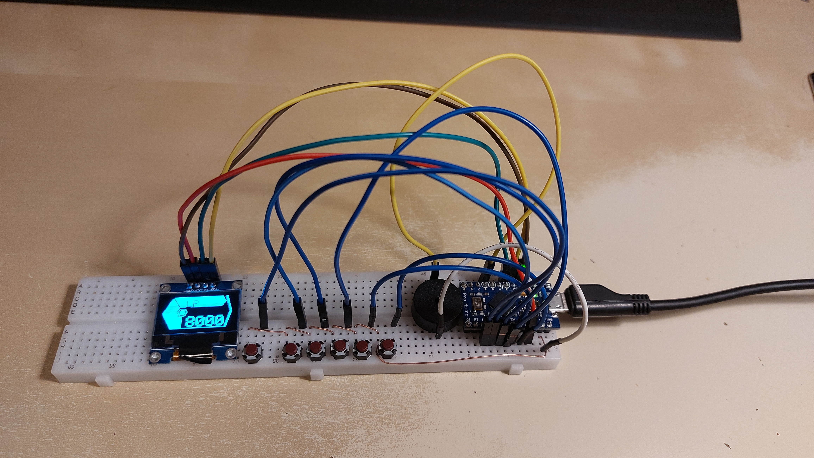
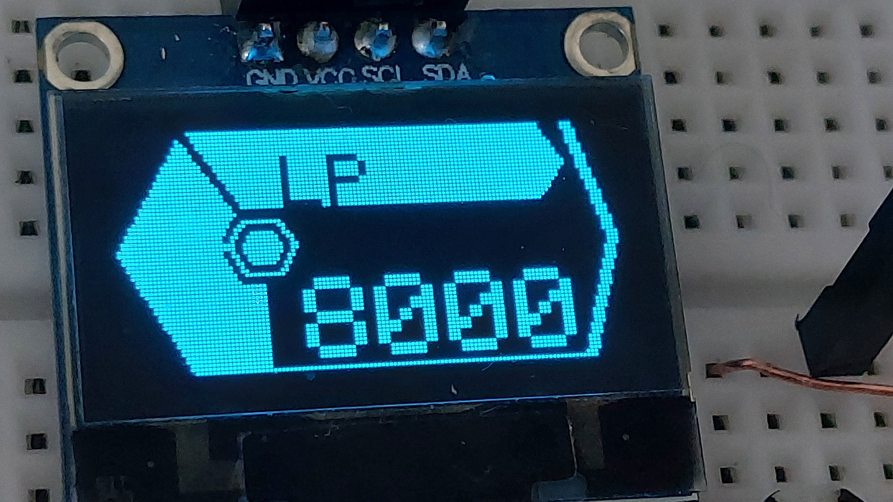
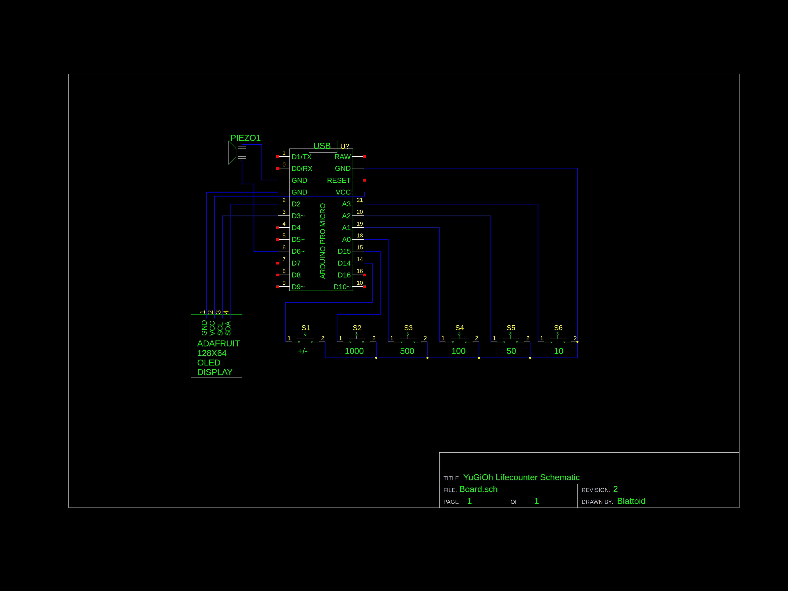

# LifepointCounter
## Backstory
A friend of mine expressed an interest in constructing a device to keep track of his health value in the YuGiOh card game, specifically he wanted to integrate it into his cardboard Duel Disc. He expressed frustration about the challenges of disassembling calculators and other commercial Duel Discs, after which I suggested making one from scratch with an Arduino and other components.

After 3 days of work on my end, this repository contains everything that I came up with. I aimed to create a prototype of the device on a breadboard, along with the Arduino code and a schematic of the wiring. All three of these goals have been completed.

## Description
The device features 6 buttons, a piezo buzzer, and an OLED display. 5 of the 6 buttons represent a value to apply to the number, while the 6th button toggles between subtracting and adding to the number. All actions are accomodated with variable-frequency beeps from the piezo and the display updates in real-time.

Pressing a value button will cause the Arduino to either subtract or add 10 repeatedly, for however many times is needed to reach the requested value. Each time it does this, the buzzer will chirp and the display's value and health bar will be adjusted accordingly. Should the number reach 0, a GAME OVER screen flashes thrice, all accompanied by cheesy buzzer effects.

## Images
**Functional prototype on a breadboard**

**Close up of the display**

**Circuit diagram**

## Parts list
* Arduino Pro Micro (x1)
* Adafruit SSD1306 128x64 I²C OLED Display (x1)
* Tactile Push Buttons (x6)
* * Depending on the quality of the buttons, it may be necessary to put 100nF capacitors in parallel with them as debouncers
* A bunch of wires (About 18, with varying length)
* * Either plastic insulated or enameled copper
* Some veraboard if you want to attach the buttons to something sturdy
